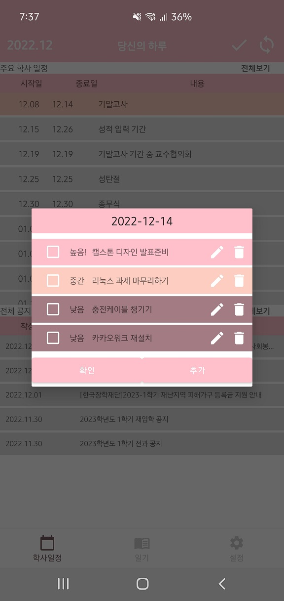
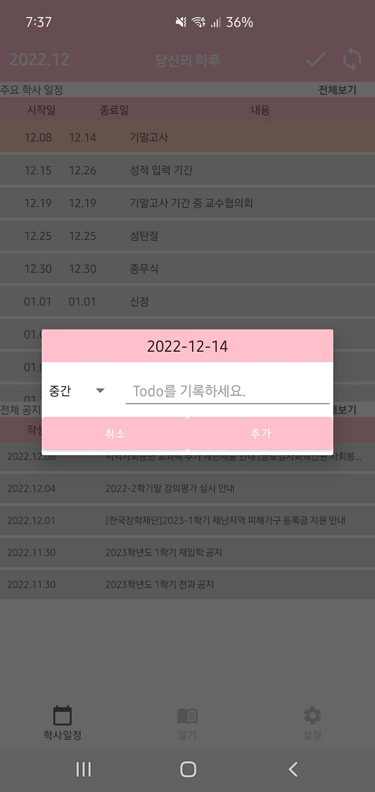
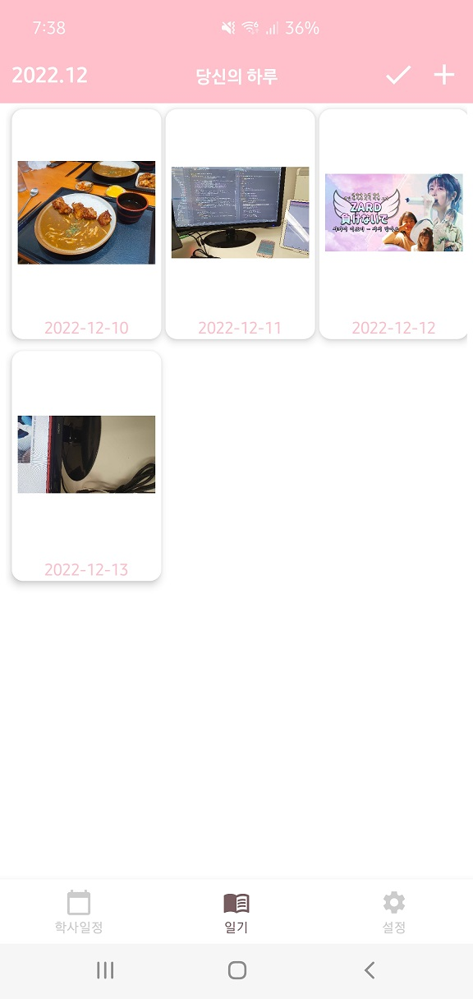
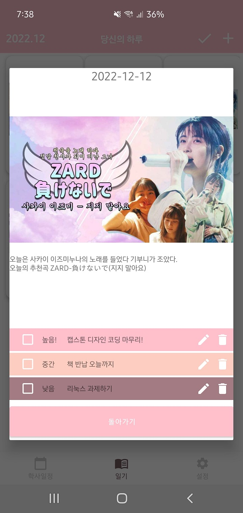
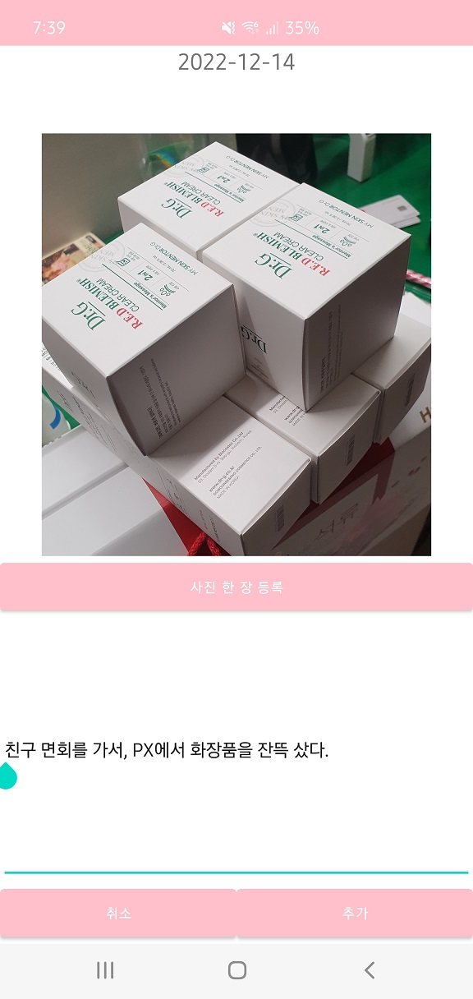
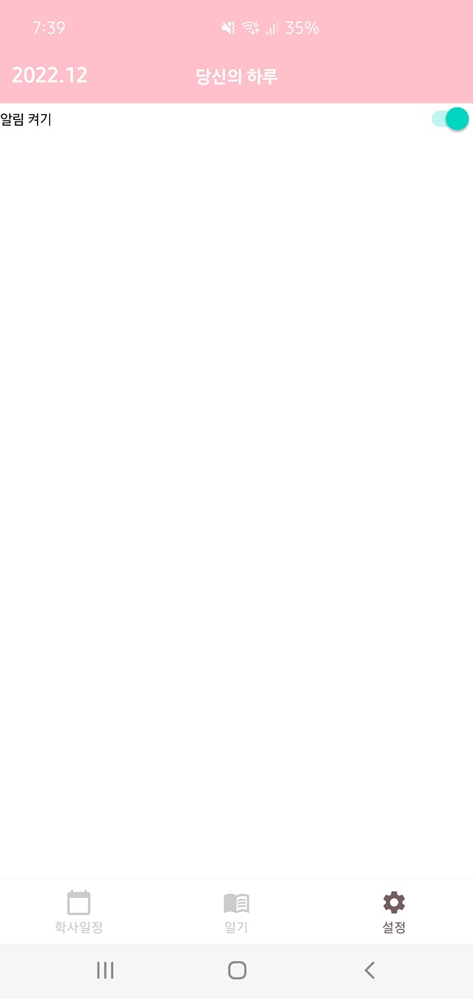

# SYU_YourDaylife_2022
- 2022.09.15 ~ 2022.12.15
- 팀원 : 김명진(4, DB), 안성민(3, 기능), 최성용(3, 디자인), 공통(코딩)

## 개발 환경
- AndroidStudio : Android Studio Bumblebee | 2021.1.1 Patch 3
- Java : 11.0.11

## 프로젝트 소개
캘린더, ToDo list, Diary 이 3가지의 기능을 합쳤다!

### <과제의 개요>
캘린더를 중심으로 ToDo list와 Diary 등 기능을 추가하여 사용자가 해야 할 일, 목표 등 메모를 하여 까먹지 않고 목표와 할 일을 이룰 수 있게 도와줍니다. 단순한 캘린더 보다 기능을 추가하는 동시에 사용자가 편하게 사용할 수 있고, 보기 좋게 만드는 것이 목표입니다.
### <과제의 목표>
우리 프로젝트의 목표 기능은 총 3가지이다. 첫 번째로, 언제 어디서나 쉽게 할 일이나 목표를 적을 수 있는 Todo List 기능이다. 사용자는 Todo List 기능을 통하여 매우 간단하게 자신의 머릿속에 있는 할 일을 스마트폰 메모리로 빠르게 옮김으로써 지금 하고 있던 일에 집중할 수 있다. 두 번째로, Todo List를 적어둔 날짜와 시간을 좀 더 쉽게 찾을 수 있는 Calender 기능이다. 사용자는 복잡하게 언제 어디에 Todo List를 적어두었는지 찾을 필요 없이, 월별 캘린더를 한눈에 보면서 해야 할 일을 쉽게 찾고 정리할 수 있다. 세 번째로, Todo List 뿐만 아니라, 사용자의 목적에 맞게 세분된 기록장을 제공하는 Diary이다. 단순히 텍스트 형식의 Todo List에서 차별점을 추가한 요소이다. 사용자는 Todo List의 목적에 따른 Diary 형식의 개인화된 틀(Form)을 받음으로써 조금 더 세분화된 목표와 메모를 작성하여 생산성을 증진시킬 수 있다.
### <과제 수행방법>
과제를 위한 도구는 Google 사의 ‘Android Studio’라는 IDE를 적극적으로 활용하여
‘AndrodiOS’에 맞는 애플리케이션 제작을 하고 애플리케이션 개발의 큰 틀인 개발, 기획, 디자인을 각각 관리하도록 인원을 배치하여 전 인원이 각각의 항목마다 개발에 참여하고 해당하는 항목의 관리자가 해당 항목을 관리함으로써 책임감을 가지고 애플리케이션 개발에 참여할 예정입니다.
또한 최근 COVID-19로 인하여 매번 회의 진행을 대면으로 진행하기 힘듦을 고려해 ‘Discord’사의 ‘Discord’라는 메신저를 통하여 실시간으로 음성채팅과 사진 및 화면 공유를 통하여 회의를 진행하고 각자의 개발현황을 게시판 기능을 통해 전 팀원에게 공유하여 팀이 목표로 하는 마일스톤에 지장 없이 도달하게끔 과제를 진행할 예정입니다.
### <과제의 기대효과>
기존의 상용 ToDo List, Diary, Calender 애플리케이션들의 핵심 기능을 모음으로써 소비자들이 자주 사용하고 선호하는 핵심기능을 모아 기존의 상용 애플리케이션들을 사용하지 않는 예비 소비자들에게 편리함을 어필하고 기존의 상용 애플리케이션들을 사용하는 소비자들에게는 여러 애플리케이션들을 사용하지 않아도 된다는 장점을 어필함으로써 해당 애플리케이션의 사용을 유도하여 애플리케이션 스토어에서 소비자층을 끌어모을 수 있을거로 생각합니다.

## 실행 화면
- UI 프로토타입 : https://ovenapp.io/view/HsdDv6l7xo088ybvAPQHbM9aCCHPXbld/aBXrk
- 실제 UI

## 직접 실행 방법
- 깃 코드를 압축파일로 다운로드 한다.
- 기타 오류 방지를 위해, 위에 써놓은 '개발환경' 버전에 맞는 Java와 Android Studio를 설치한다.
- 다운로드한 프로젝트 압축파일을 푼 후, 설치한 Android Studio를 실행하여 불러온다.
- gradle sync오류를 방지하기 위해, build.gradle(Module: UI.app) 을 열어서 아무 내용이나 입력 후 Sync를 해준다.
- API26이상의 안드로이드 기기 (실물 기기 또는 AVD에뮬레이터를 이용하여) 프로젝트를 실행한다.

## 아쉬웠던 점
- 프로토타입 UI와 크게 달라짐. (내 실력 부족)
- 팀원들과의 소통이 부족했음. (덕분에, 개발 막바지에 UI가 크게 바뀌어버림)
- 화이트박스 테스트를 진행하지 못하였음.
- 여러가지 잔 버그가 많음.
- '다크모드' 테마를 적용하지 못하였음.
- 스파게티 코드. 중복코드가 아주 많음.
- MVC패턴 적용을 실패하였음. (개발 시작전 설계 부족)